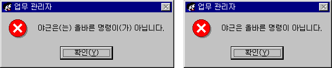

# K-POPO

[ ](https://bundlephobia.com/package/k-popo@latest) 

Fast, less-than-1kB Korean _postposition_ (_josa_, 조사) resolver with a pleasant API.



K-POPO supports broad postpositions, yet is smaller and faster than other tagged literal/parsing libraries. Run [`benchmark`](./benchmark) for bechmarks.

- [Example](#example)
- [API](#api)
- [Available postposition tokens](#available-postposition-tokens)

## Example

```js
import { ko } from 'k-popo'

ko`그러자 ${name}(을)를 찾으며 말씀하시었으니, ${name}(아)야, 어디 있느냐?`
// name=재민: 그러자 재민을 찾으며 말씀하시었으니, 재민아, 어디 있느냐?
// name=민재: 그러자 민재를 찾으며 말씀하시었으니, 민재야, 어디 있느냐?
ko`${schedule}(이)여서 추가할 수 없어요. ${role}(이)가 필요합니다.`
// schedule=평일, role=관리자: 평일이어서 추가할 수 없어요. 관리자가 필요합니다.
// schedule=회의, role=어드민: 회의여서 추가할 수 없어요. 어드민이 필요합니다.
```

## API

### `ko: (TemplateStringsArray, ...(string | [string, string])[]) => string`

Resolves all Korean [_postposition tokens_](#available-postposition-tokens) placed right next to a placeholder.

```js
expect(ko`${'디자이너'}(으)로서 좌시할 수 없다.`).toBe('디자이너로서 좌시할 수 없다.')
expect(ko`${'원청'}(으)로서 좌시할 수 없다.`).toBe('원청으로서 좌시할 수 없다.')
expect(ko`${'경찰'}(으)로서 좌시할 수 없다.`).toBe('경찰로서 좌시할 수 없다.')

expect(ko`${`'너'`}(은)는 모른다.`).toBe(`'너'는 모른다.`)
expect(ko`${`"당신"`}(은)는 모른다.`).toBe(`"당신"은 모른다.`)
```

Grammatically correct postpositions with closed parenthesis groups in placeholders:

```js
expect(ko`${`너(당신)`}(은)는 모른다.`).toBe(`너(당신)는 모른다.`)
expect(ko`${`당신(너)`}(은)는 모른다.`).toBe(`당신(너)은 모른다.`)
```

`ko` can also resolve tokens against numbers:

```js
expect(ko`알고 계셨나요? ${'1'}(은)는 미지의 수입니다.`).toBe('알고 계셨나요? 1은 미지의 수입니다.')
expect(ko`알고 계셨나요? ${'3'}(은)는 미지의 수입니다.`).toBe('알고 계셨나요? 3은 미지의 수입니다.')
expect(ko`알고 계셨나요? ${'5'}(은)는 미지의 수입니다.`).toBe('알고 계셨나요? 5는 미지의 수입니다.')
expect(ko`알고 계셨나요? ${'7'}(은)는 미지의 수입니다.`).toBe('알고 계셨나요? 7은 미지의 수입니다.')
expect(ko`알고 계셨나요? ${'9'}(은)는 미지의 수입니다.`).toBe('알고 계셨나요? 9는 미지의 수입니다.')
```

Even with separators:

```js
expect(ko`${'40000'}(으)로 곱하면 안전하지 않습니다.`).toBe('40000으로 곱하면 안전하지 않습니다.')
expect(ko`${'40,000'}(으)로 곱하면 안전하지 않습니다.`).toBe('40,000으로 곱하면 안전하지 않습니다.')
```

> **Note:** For numbers beginning with one trillion (1,000,000,000,000, "1조"), `ko` can't guarantee correctness.

It can work with English words as well:

```js
expect(ko`${'Null'}(은)는 좋지 않습니다. ${'Editor'}(이)가 싫어합니다.`).toBe(
  'Null은 좋지 않습니다. Editor가 싫어합니다.',
)
expect(ko`${'Undefined'}(은)는 좋지 않습니다. ${'System'}(이)가 싫어합니다.`).toBe(
  'Undefined는 좋지 않습니다. System이 싫어합니다.',
)
```

> **Note:** For English words, `ko` can't guarantee correctness.

#### Providing pronunciation

To achieve better results, you may opt to supply pronunciations for English words or huge numbers. Use `[word: string, pronunciation: string]` tuples in placeholders:
 
```js
expect(ko`${'8000000000000'}(이)가 있으면 어떻게 할래?`).toBe('8000000000000이 있으면 어떻게 할래?')
expect(ko`${['8000000000000', '팔조']}(이)가 있으면 어떻게 할래?`).toBe('8000000000000가 있으면 어떻게 할래?')

expect(ko`8개의 ${'bit'}(이)가 ${'byte'}(을)를 만듭니다.`).toBe('8개의 bit가 byte를 만듭니다.')
expect(ko`8개의 ${['bit', '빗']}(이)가 ${['byte', '바잍']}(을)를 만듭니다.`).toBe('8개의 bit이 byte을 만듭니다.')
```

> **Note:** Obviously, you have to get the pronunciation for the word somehow.

## Available postposition tokens

| Token                 | Resolved value | Examples                           |
| --------------------- | -------------- | ---------------------------------- |
| `(은)는`              | 은/는          | 한국은, 독일은, 러시아는           |
| `(이)가`              | 이/가          | 한국이, 독일이, 러시아가           |
| `(을)를`              | 을/를          | 한국을, 독일을, 러시아를           |
| `(과)와`              | 과/와          | 한국과, 독일과, 러시아와           |
| `(으)로`[써, 서, ...] | 으로/로        | 한국으로, 독일로, 러시아로         |
| `(이)여`              | 이어/여        | 한국이어서, 독일이어서, 러시아여서 |
| `(아)야`              | 아/야          | 한국아, 독일아, 러시아야           |
| `(이)`[랑, 면, ...]   | 이/            | See below                          |

### `(이)` token

The `(이)` token represents "이" _ending_ (어미), not a whole postposition. When the placeholder before the `(이)` token ends without a _final consonant_ (종성), it simply removes itself. Otherwise, the token becomes `이`. As a result, `(이)` can be used in conjunction with other characters to form almost all postpositions. For examples:

- (이)랑: 한국이랑, 독일이랑, 러시아랑
- (이)더라: 한국이더라, 독일이더라, 러시아더라
- (이)면: 한국이면, 독일이면, 러시아면
- (이)나, (이)나마, (이)든지, (이)야말로...
